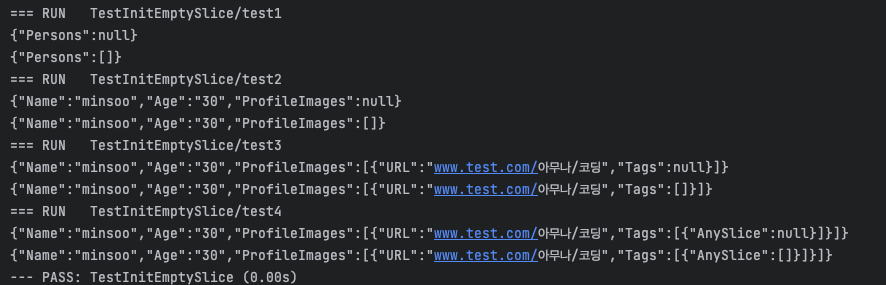

## 설명
프론트와 백엔드는 JSON으로 소통하지만, Go 언어 특성상 nil slice는 null로 변환됩니다. 이는 프론트가 null 체크해야하는 불편함을 주기 때문에 항상 empty slice로 주고 받기로 결정했습니다. 
그래서 해당 유틸함수를 개발하였습니다. 
- nested struct에서도 동작합니다.
- Exported Field 있는 struct만 사용해야합니다.  

## 예시
```go
type ListPersons struct {
	Persons []Person
}

type Person struct {
	Name          string
	Age           string
	ProfileImages []Image
}

type Image struct {
	URL  string
	Tags []Tag
}

type Tag struct {
	AnySlice []string
}

```

## 결과 
- 첫 번째 적용전
- 두 번째 적용후

